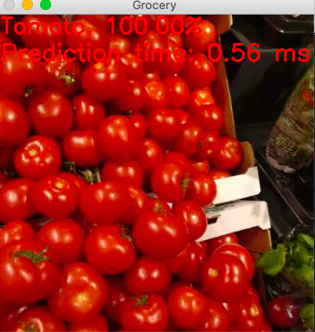

# E2E-Tensorflow-keras-grocery-items-image-classification

This project attempts to implement an end to end image classification using tensorflow keras and onpencv.

The project is using Conda for project environment management.
- conda env create -f environment.yml
- conda activate rpicv4

# Preprocess Data:
To preprocess data
  - cd preprocess_data
    -  python data_preprocess.py
    
# Training:
To perform training
  - python fine_tune.py --model model/grocery.h5
# Prediction:
To execute prediction on some sample data
  - convert keras h5 to optimize pb file
    - cd utils
    - python h5_to_pb.py --model ../model/grocery.h5 --frozen_graph ../model/grocery.pb
  - python prediction.py --inference_mode image
  
Setup the project environment:
The categories particularly were given as:

- Apple
- Avocado
- Banana
- Ginger
- Juice
- Kiwi
- Lemon
- Melon
- Milk
- Pepper
- Tomato
